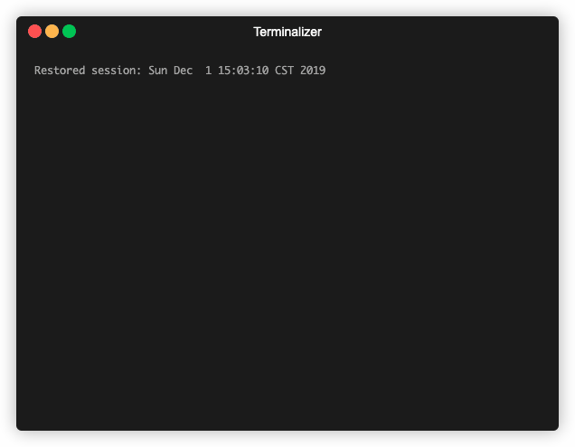

# Ling - A (work-in-progress) boolean expression simplifier.



## Grammar

```
<statement>   ::= <equivalence> | ''

<equivalence> ::= <implication> | <implication> '=' <equivalence>

<implication> ::= <disjunction> | <disjunction> '->' <implication>

<disjunction> ::= <conjuction> | <conjunction> '+' <disjunction>

<conjunction> ::= <negation> | <negation> '*' <conjunction>

<negation>    ::= <identifier> | <negation> '\''

<identifier>  ::= <letter> | <letter> <identifier> | '(' <statement> ')'

<letter>      ::= 'a' ... 'z' | 'A' ... 'Z'
```